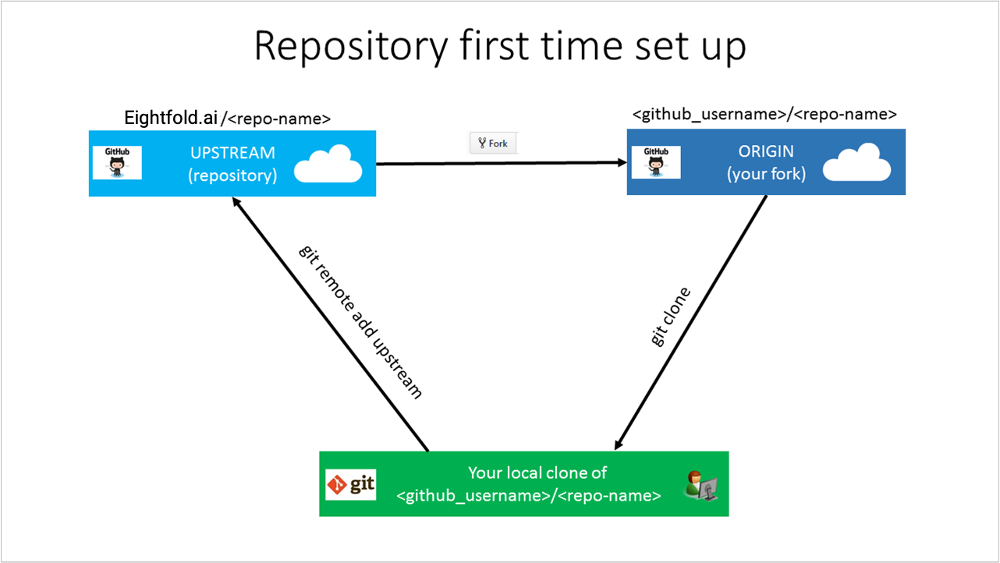
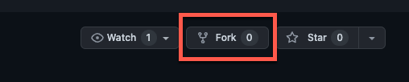

# Eightfold Octuple Design System Component Library

## Prerequisites

-   Install the following:

-   [Git](https://git-scm.com/)
-   [Node](https://nodejs.org/en/download/)
-   [Yarn](https://yarnpkg.com/getting-started/install)
-   [NVM (optional to quickly use different versions of Node)](https://github.com/nvm-sh/nvm)

## Available Scripts

from the project root folder, you can run:

### `yarn storybook`

Runs the app in the development mode.
Open [http://localhost:2022](http://localhost:2022) to view it in the browser.

The page will reload if you make edits.
You will also see any lint errors in the console.

### `yarn build-storybook`

Builds the Octuple Design System Storybook project for deployment to the `dist` folder.

### `yarn test`

Runs the UTs.

### `yarn`

Builds the Octuple Design System Component Library for prod publishing to NPM in to the `lib` folder.
Should also run the UTs as part of the process.
Your package is ready to be published!

## Contributing

### Setting up your local Git repository

This section describes the steps to set up a Git repository on your local machine, with the intent to contribute to the Eightfold Octuple project. Contributors may use a locally cloned repository to add new components, utilities, do major edits on existing components, or change assets.

One-time setup activities to start contributing:

-   Fork the [Octuple repository](https://github.com/EightfoldAI/octuple) to your GitHub account
-   Choose a local folder for the cloned files
-   Clone the repository to your local machine
-   Configure the upstream remote value

### Overview

To contribute to Eightfold's Octuple project, you can make and edit assets, utilities, and components by cloning the [Octuple repository](https://github.com/EightfoldAI/octuple). Eightfold requires you to fork the [Octuple repository](https://github.com/EightfoldAI/octuple) into your own GitHub account so that you have read/write permissions there to store your proposed changes. Then you use pull requests to merge changes into the read-only central shared repository.



### Fork the repository

Using the appropriate repository, create a fork of the repository into your own GitHub account by using the GitHub website.

A personal fork is required since the main repositorty provides read-only access. To make changes, you must submit a pull request from your fork into the main repository. To facilitate this process, you first need your own copy of the repository, in which you have write access. A GitHub fork serves that purpose.

1. Go to the main repository's GitHub page and click the Fork button on the upper right.

    

2. If you are prompted, select your GitHub account tile as the destination where the fork should be created. This prompt creates a copy of the repository within your GitHub account, known as a fork.

### Choose a local folder

Make a local folder to hold a copy of the repository locally. Choose a location with available disk space.

1. Choose a folder name should be easy for you to remember and type. For example, consider a root folder `C:\source\`

2. Launch Git Bash, PowerShell (Windows) or Terminal (Mac OS) and Change directory (cd) into the folder that you created for hosting the repository locally. Note that Git Bash and Terminal use the Linux convention of forward-slashes instead of back-slashes for folder paths. For example, `cd /c/docs/` or `cd ~/Documents/docs/`

### Create a local clone

Using command line interface, prepare to run the clone command to pull a copy of a repository (your fork) down to your device on the current directory.

1. Run the clone command, by providing the repository name. Cloning downloads (clone) the forked repository on your local computer.

Be sure to specify the path to your fork during the cloning process, not the main repository from which you created the fork. Otherwise, you cannot contribute changes. Your fork is referenced through your personal GitHub user account, such as `github.com/<github-username>/<repo>`.

```
git clone https://github.com/<github-username>/<repo>.git
```

Your clone command should look similar to this example:

```
git clone https://github.com/imadev/octuple.git
```

2. When you're prompted, enter your GitHub credentials and two-factor authentication code.

3. The clone command runs and downloads a copy of the Octuple repository files from your fork into a new folder on the local disk. A new folder is made within the current folder. It may take a few minutes, depending on the repository size. You can explore the folder to see the structure once it is finished.

### Configure remote upstream

After cloning the repository, set up a read-only remote connection to the main repository named upstream. You use the upstream URL to keep your local repository in sync with the latest changes made by others. The git remote command is used to set the configuration value. You use the fetch command to refresh the branch info from the upstream repository.

1. If you're using Git Credential Manager, use the following commands.

```
cd <repo>
git remote add upstream https://github.com/EightfoldAI/octuple.git
git fetch upstream
```

2. View the configured values and confirm the URLs are correct. Ensure the origin URLs point to your personal fork. Ensure the upstream URLs point to the main repository.

```
git remote -v
```

Example remote output is shown. A fictitious git account named MyGitAccount is configured with a personal access token to access the Octuple repo:

```
origin  https://github.com/MyGitAccount/octuple.git (fetch)
origin  https://github.com/MyGitAccount/octuple.git (push)
upstream        https://github.com/EightfoldAI/octuple.git (fetch)
upstream        https://github.com/EightfoldAI/octuple.git (push)
```

3. If you made a mistake, you can remove the remote value. To remove the upstream value, run the command `git remote remove upstream`.

### Component code style guide

The Octuple project provides evolving guidelines. To learn more about how to create new, or edit existing components read [COMPONENTS.md](./components/COMPONENTS.md)

### Commits

When committing changes the Octuple project lints commit messages using the [Conventional Commits specification](https://www.conventionalcommits.org/en/v1.0.0-beta.2/). The subject line `<description>` must not be sentence-case, start-case, pascal-case, upper-case and must contain one of the following key words representing the `<type>` of commit: build, chore, ci, docs, feat, fix, perf, refactor, revert, style, test. The subject line: `<type>[optional scope]: <description>` must not be greater than 100 characters. The combined `[optional body]` and `[optional footer]` must not be greater than 100 characters.

```
<type>[optional scope]: <description>

[optional body]

[optional footer]
```

An example of such a message:

```
fix: ABC-123: button not keyboard accessible

The button component had a tabIndex of -1 by default
and therefore it was not keyboard accessible
```

### Pull requests

A pull request provides a convenient way for a contributor to propose a set of changes that will be applied to the upstream repo's main branch. The changes (also known as commits) are stored in a contributor's downstream repo branch, so GitHub can first model the impact of merging them into the main branch. A pull request also serves as a mechanism to provide the contributor with feedback from a build/validation process, the pull request reviewer, to resolve potential issues or questions before the changes are merged into the main branch.

To learn more please read:

-   [GitHub flow](https://docs.github.com/en/get-started/quickstart/github-flow)
-   [Creating a pull request](https://docs.github.com/en/pull-requests/collaborating-with-pull-requests/proposing-changes-to-your-work-with-pull-requests/creating-a-pull-request)
-   [Creating a pull request from a fork](https://docs.github.com/en/pull-requests/collaborating-with-pull-requests/proposing-changes-to-your-work-with-pull-requests/creating-a-pull-request-from-a-fork).

## License

MIT (c) 2022 Eightfold
